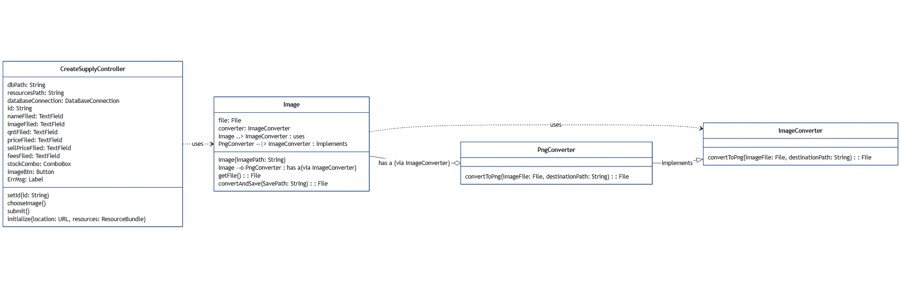
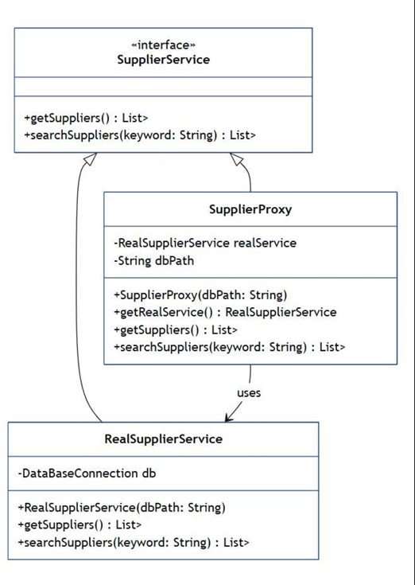
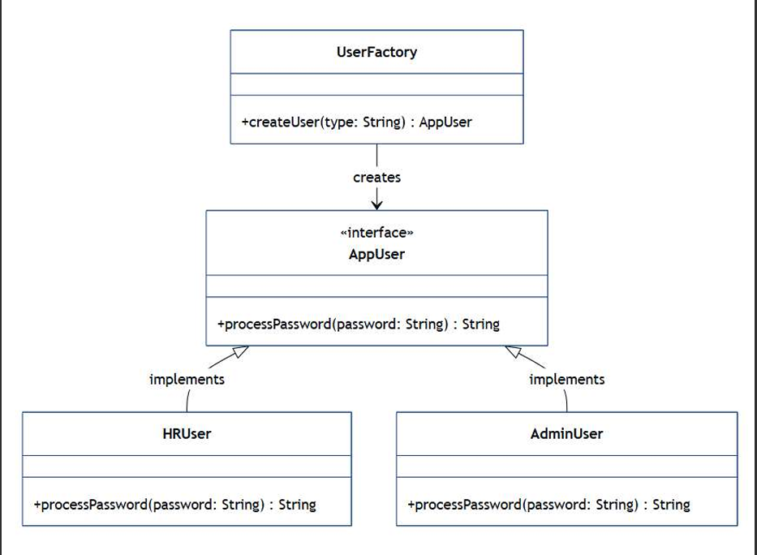
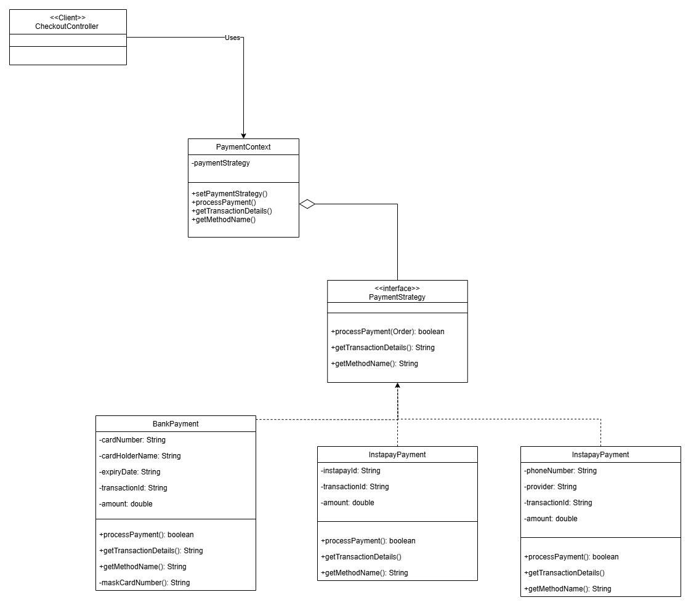
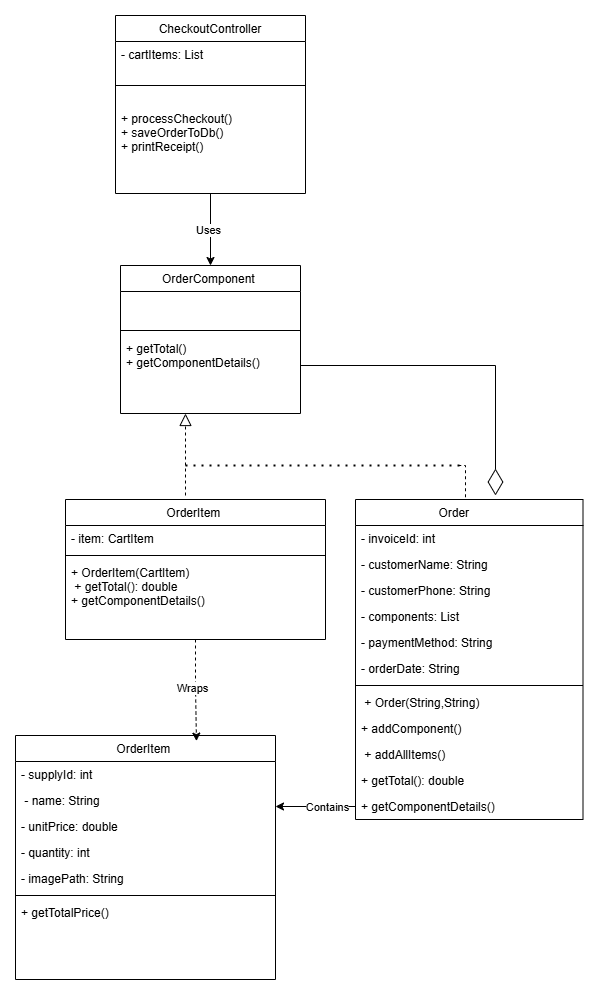
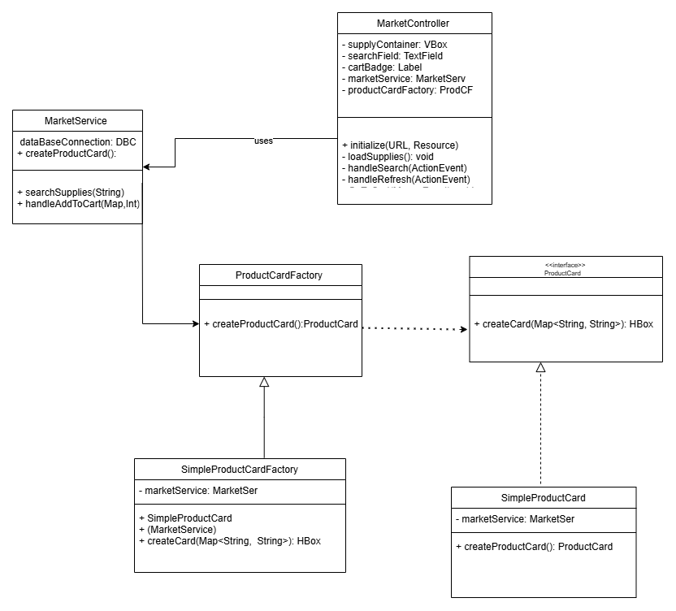

# ERP-Project

---
## ✅ Omar Lashin 🔥 : 

### - 🔥 Stores Creation using Factory Design Pattern ✅

### - 🔥 Converting supply images from any extension to PNG using Adapter Pattern ✅

---
## ✅ Martin Maged 🔥 :

### - 🔥 Refreshment of Database using Proxy Pattern ✅

### - 🔥 Session handling using Singelton Pattern ✅

---
##  ✅ Ahmed Ashraf 🔥  : Lazy Initialization of Supplier DB Connections via Proxy Pattern & ✅ Applied Factory Method Pattern for Login User Type Handling

---
## ✅ Eslam Nasser 🔥 :

### - 🔥 Payment gateway handling using Strategy Pattern ✅

### - 🔥 Ordering items handling by using Composite Pattern ✅

### - 🔥 Product cards in our market by using Factory Pattern ✅

---
