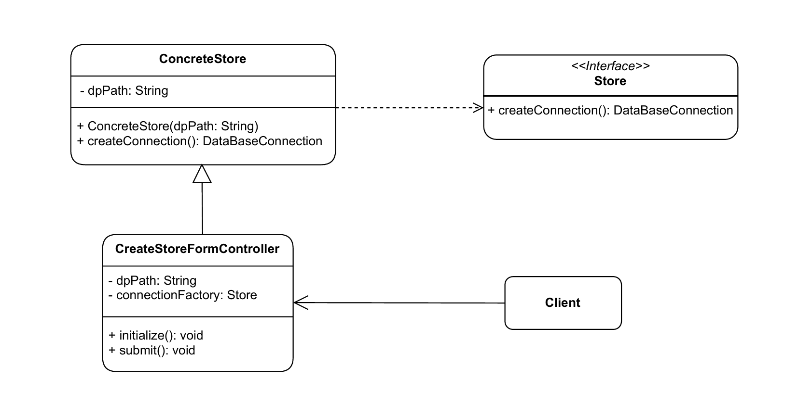
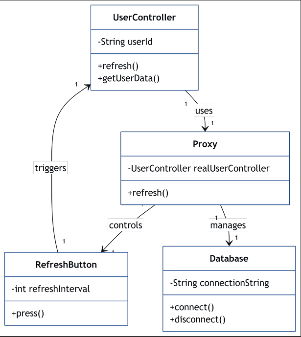
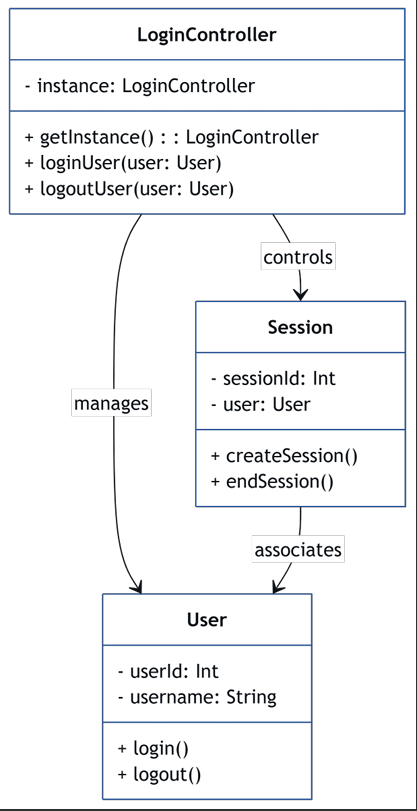
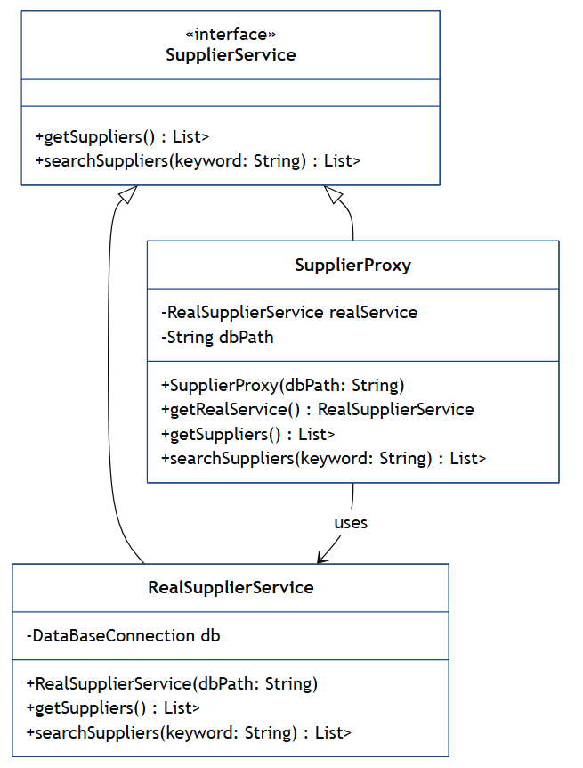

# ERP-Project

---
## ✅ Omar Lashin 🔥 : Stores Creation using Factory Design Pattern

---
## ✅ Martin Maged 🔥 : Refreshment of Database using Proxy Pattern

---
## ✅ Martin Maged 🔥 : Session handling using Singelton Pattern

---
##  ✅ Abo Ashraf 🔥  : Lazy Initialization of Supplier DB Connections via Proxy Pattern

---
